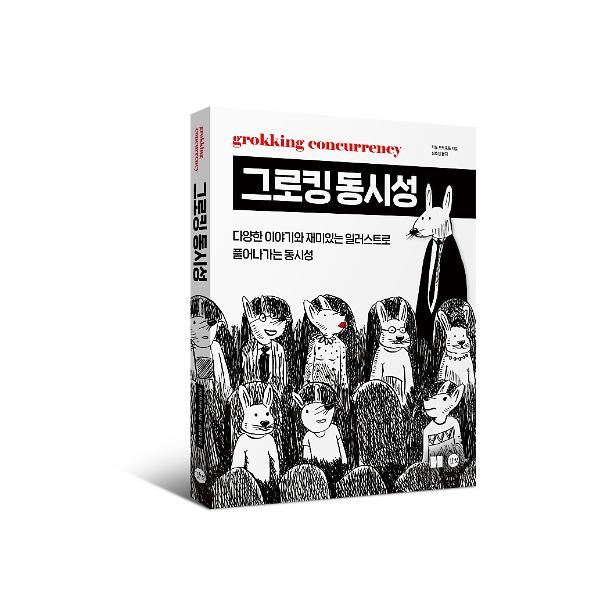

# Grokking Concurrency

## 💻 공부는 Notion 개인 페이지를 통해 정리하였습니다.

 

[Chapter 02. 순차 실행과 병렬 실행](https://moondongmin.notion.site/Chapter-02-158357c44e5680dcab25dca36a03b607?pvs=4)

[Chapter 03. 컴퓨터의 동작 원리](https://moondongmin.notion.site/Chapter-03-159357c44e568059bfa2f935a230f4c0?pvs=4)

[Chapter 04. 동시성을 구현하는 재료](https://moondongmin.notion.site/Chapter-04-15a357c44e568043909df1df1f90a0bc?pvs=4)

[Chapter 05. 프로세스 간 통신](https://moondongmin.notion.site/Chapter-05-15e357c44e5680f08a44e4b0c1702e81?pvs=4)

[Chapter 06. 멀티태스킹](https://moondongmin.notion.site/Chapter-06-164357c44e568054bf6adbba7d28d44c?pvs=4)

[Chapter 07. 작업 분해하기](https://moondongmin.notion.site/Chapter-07-168357c44e5680be8807c3e910e444a3?pvs=4)

[Chapter08. 동시성과 관련된 문제 해결하기: 경쟁 조건과 동기화](https://moondongmin.notion.site/Chapter08-16a357c44e56803c8350ee3330906599?pvs=4)

[Chapter 09. 동시성과 관련된 문제 해결하기: 교착 상태와 기아 상태](https://moondongmin.notion.site/Chapter-09-16b357c44e568073aaf0ef7072db8df9?pvs=4)

[Chapter 10. 논블로킹 I/O](https://moondongmin.notion.site/Chapter-10-I-O-175357c44e56806484a1f8b03615bb22?pvs=4)
